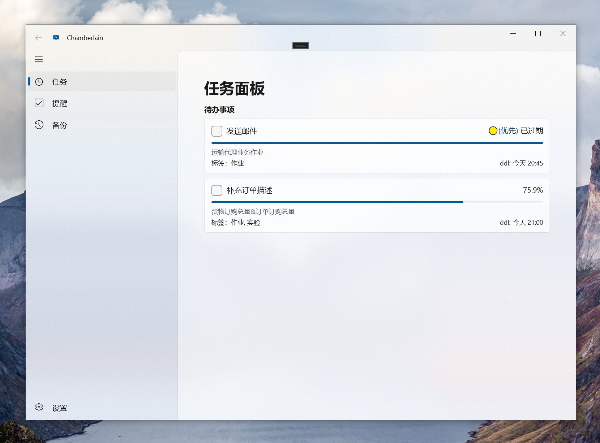
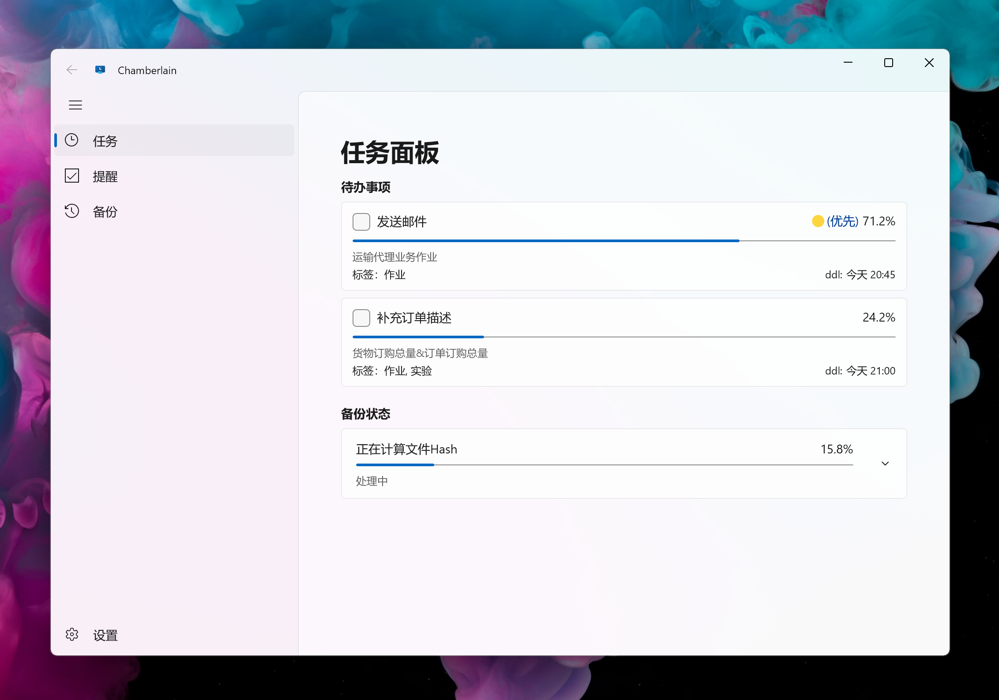
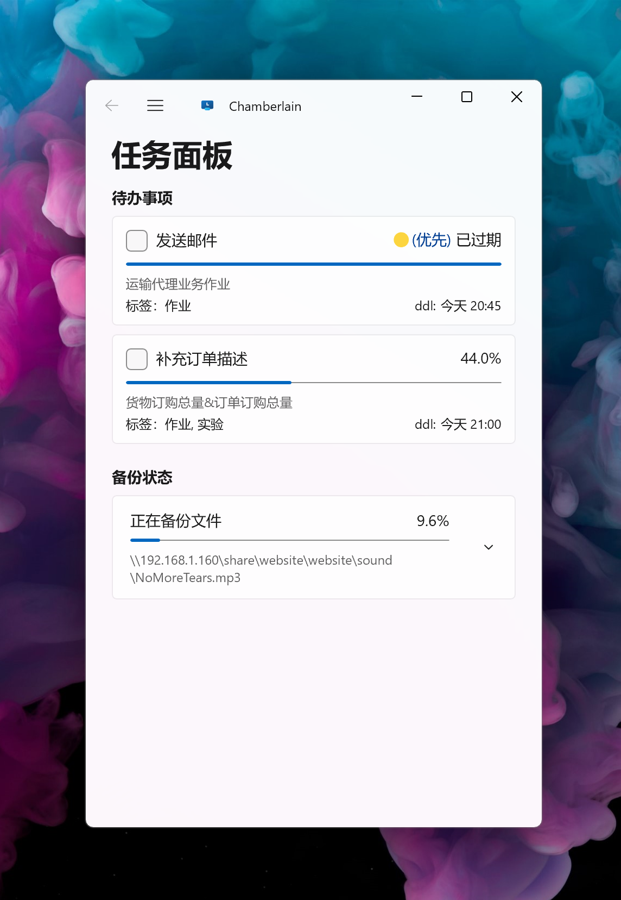

# Chamberlain_UWP
 

[English](./README_EN.md) | [简体中文](./README.md)

目前是一个UWP版本的 Todo Manager & Backup Manager

## 简单介绍
又一个重复造轮子的项目🤣
可是自己写的东西用起来就是比较舒服（主要是好看），要啥造啥😉
功能暂时就这么多，如果想到会继续更新

## 功能

### 待办事项✅
#### 通知和提醒
- 通过磁贴显示未完成的待办事项（Win10）
- 通过通知在事件到期前提醒
- 每日定时发送通知呈上目前待办事项的情况

#### 事项显示
- 进度条显示时间进度（真实deadline🤣）
- 事项优先级显示

### 文件备份📁
- 通过创建任务列表，允许备份多个文件夹，并将其保存到多个目录。
- 通过备份记录恢复备份的文件，支持恢复到原文件夹 & 导出到下载文件夹
- 快速备份：通过与最近一次完整备份进行比对，跳过不需要备份的文件，节省空间。
- 备份任务序列：一次添加多个备份任务到备份序列进行备份，无需手动操作每个备份。