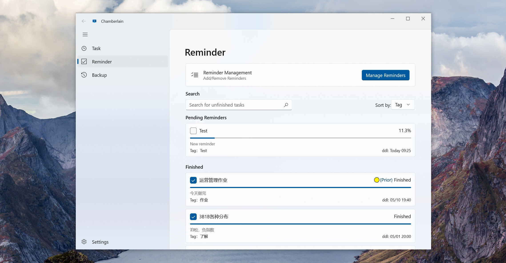

# Chamberlain\_UWP

 

[English](./README_EN.md) | [简体中文](./README.md)

Currently, it's a UWP version of Todo Manager & Backup Manager. And I feel glad to bring multilingual support to this project.

## Brief Introduction

Another project of reinventing the wheel 🤣 But it feels comfortable (mainly because it looks good) to use something you've built yourself. I just like the feeling of making whatever I need 😉 For now, the functionality is limited, but I'll continue updating it if I come up with more ideas.

## Features

### Todo List ✅

#### Notifications and Reminders

*   Display unfinished todo items on Live Tiles (Win10)
*   Send reminders through notifications before the due time
*   Daily scheduled notifications summarizing the current todo items

#### Item Display

*   Show progress bar indicating time progress (real deadline 🤣)
*   Display item priorities

### File Backup 📁

*   Create backup tasks to allow backing up multiple folders and saving them to multiple destinations.
*   Restore backed-up files from backup records, supporting restore to the original folder or export to a download folder.
*   Quick backup: Compare with the most recent full backup to skip unnecessary files, saving space.
*   Backup task sequence: Add multiple backup tasks to a backup sequence for automated backup without manual intervention.

## Special thanks to

* CommunityToolkit.MVVM
* Microsoft.Toolkit.Uwp
* Microsoft.UI.Xaml